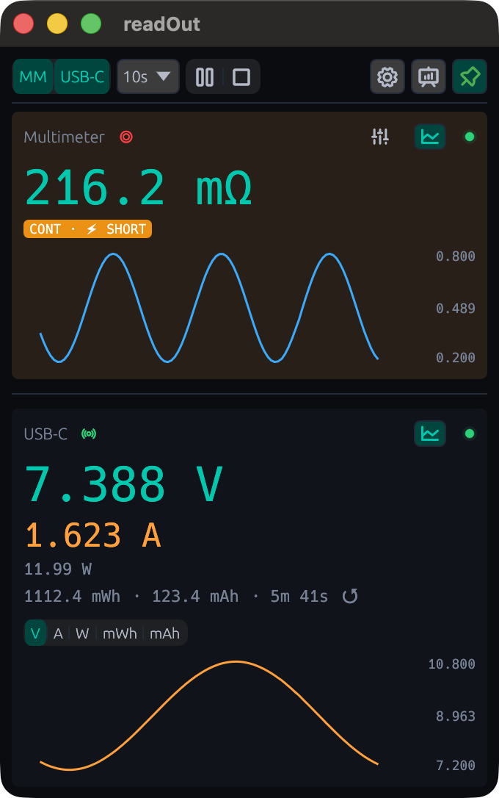
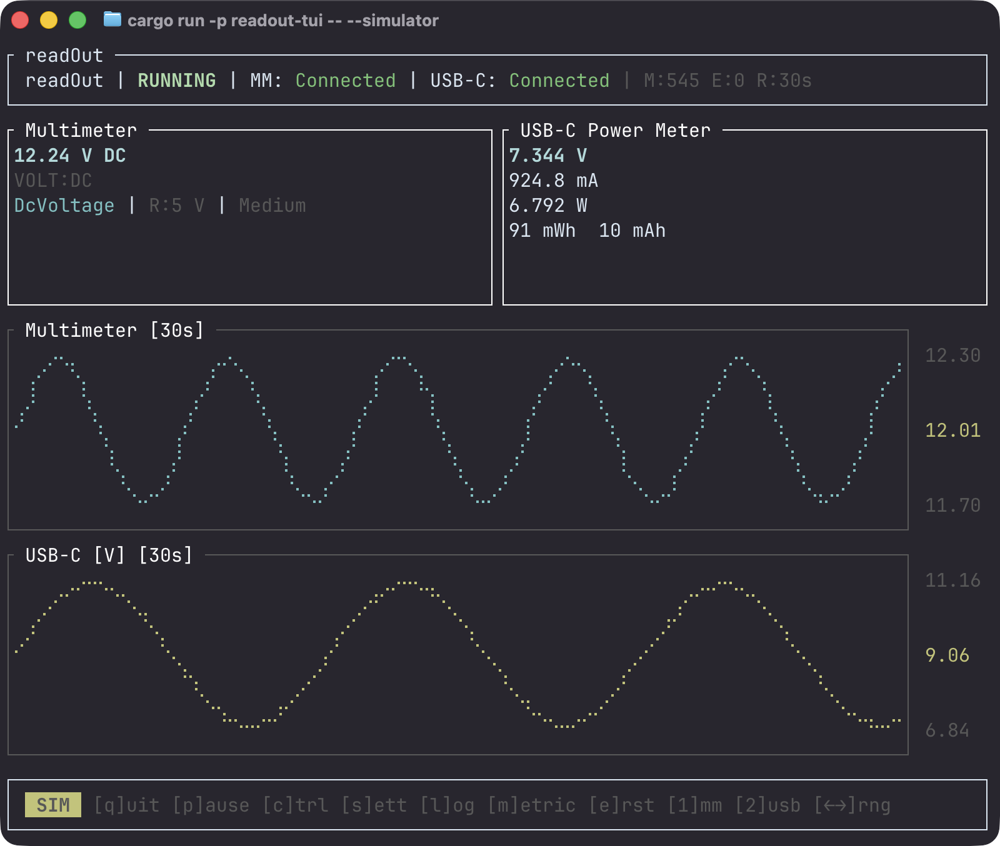
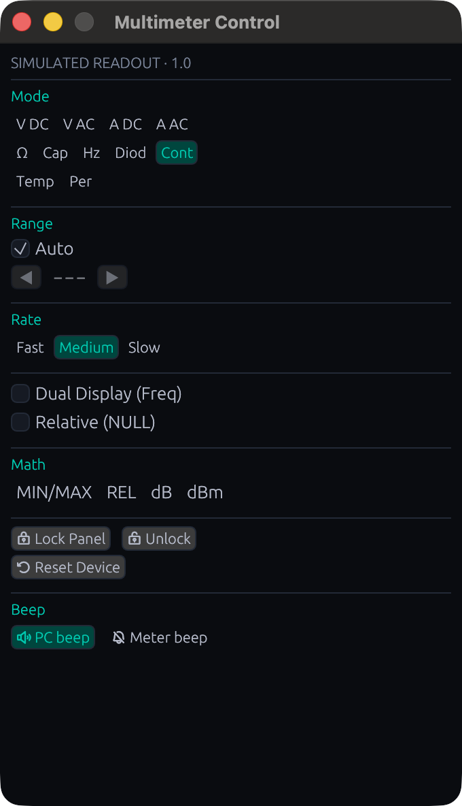

<p align="center">
  
</p>

# readOutRS

Real-time measurement dashboard for SCPI multimeters and USB-C power meters.

Rust rewrite of [readOut](https://github.com/vaclavik-xyz/readOut) with two frontends:
- **readout-gui** — lightweight desktop widget (egui)
- **readout-tui** — terminal dashboard (ratatui)

## Screenshots

<p align="center">
  
  <br><em>GUI</em>
</p>

<p align="center">
  
  <br><em>TUI</em>
</p>

<p align="center">
  
  <br><em>Meter Control</em>
</p>

## Supported Hardware

### Multimeter

Uses standard SCPI protocol over serial (115200 baud, 8N1). Tested with:

- **OWON XDM1041** / **XDM2041**

Other SCPI multimeters with serial output should work for basic measurement readout. Advanced features (dual display, math functions) may vary by manufacturer.

### USB-C Power Meter

- **[PLD USB-C Meter](https://pldaniels.com/shop/)** by Paul Daniels ([firmware source](https://github.com/inflex/pld-usbc-meter))

Custom binary protocol at 9600 baud — this is the only supported USB-C meter.

### Platform

Tested on **macOS** only. The codebase is cross-platform (macOS, Linux, Windows) but Linux and Windows have not been tested.

## Features

- Live voltage, current, power, and energy readings
- Configurable chart history (30s to 1h)
- Full multimeter remote control (mode, range, rate, dual display, math, NULL, filters, dB/dBm)
- CSV logging for data analysis
- OBS text file output for streaming overlays
- Alarm system (high/low voltage, short circuit) with PC and meter beep notifications
- Device visibility toggle and energy reset
- Always-on-top widget mode (GUI)
- Light/dark/system theme (GUI)
- Log panel overlay (TUI)
- Simulator mode for development without hardware

## Architecture

```
readOutRS/
├── crates/
│   ├── readout-core/         # data types, parsers, alerts, chart pipeline
│   ├── readout-io/           # serial transports, device drivers, runtime
│   └── readout-persistence/  # config, CSV logger, OBS writer
├── readout-gui/              # egui desktop widget
└── readout-tui/              # ratatui terminal dashboard
```

Channel-based event bus (`tokio::sync::broadcast`) connects the backend runtime to frontends. Each device runs as an independent Tokio task with automatic reconnection.

## Install

### macOS (Homebrew)

```bash
brew tap vaclavik-xyz/tap

# GUI app → /Applications
brew install --cask readout

# CLI binaries (readout-gui + readout-tui)
brew install readout
```

### macOS (DMG)

Download the `.dmg` from [Releases](https://github.com/vaclavik-xyz/readOutRS/releases/latest). The app is not code-signed, so macOS will block it. After copying to Applications, run:

```bash
xattr -cr /Applications/readOut.app
```

### Linux / Windows

Download the archive from [Releases](https://github.com/vaclavik-xyz/readOutRS/releases/latest) and extract the binaries.

## Build

```bash
cargo build
```

## Run

```bash
# Desktop GUI
cargo run -p readout-gui

# Terminal TUI
cargo run -p readout-tui

# With simulator (no hardware needed)
cargo run -p readout-gui -- --simulator
cargo run -p readout-tui -- --simulator
```

## Test

```bash
# Unit + integration tests
cargo test

# Soak tests (longer running)
cargo test -p readout-io --features soak -- soak --nocapture
```

## Keyboard Shortcuts

### GUI

| Shortcut | Action |
|----------|--------|
| `Cmd+P` | Pause/resume |
| `Cmd+K` | Clear charts |
| `Cmd+M` | Meter Control |
| `Cmd+,` | Settings |
| Right-click | Context menu |

### TUI

| Key | Action |
|-----|--------|
| `q` | Quit |
| `p` | Pause/resume |
| `c` | Meter control |
| `s` | Settings |
| `l` | Log panel |
| `m` | Cycle USB-C metric |
| `e` | Reset USB-C energy |
| `1` / `2` | Toggle MM / USB-C visibility |
| `←` / `→` | Chart time range |

## License

MIT
