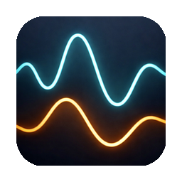

<p align="center">
  
</p>

# readOutRS

Real-time measurement dashboard for multimeters (SCPI) and USB-C power meters.

Rust rewrite of [readOut](https://github.com/vaclavik-xyz/readOut) with two frontends:
- **readout-gui** — lightweight desktop widget (egui)
- **readout-tui** — terminal dashboard (ratatui)

Cross-platform: macOS, Linux, Windows.

## Features

- Live voltage, current, power, and energy readings
- Configurable chart history (30s to 1h)
- CSV logging for data analysis
- OBS text file output for streaming overlays
- Alarm system with PC and meter beep notifications
- Multimeter remote control (mode, range, rate)
- Always-on-top widget mode
- Light/dark/system theme

## Architecture

```
readOutRS/
├── crates/
│   ├── readout-core/         # data types, parsers, alerts, chart pipeline
│   ├── readout-io/           # serial transports, device drivers, runtime
│   └── readout-persistence/  # config, CSV logger, OBS writer
├── readout-gui/              # egui desktop widget
└── readout-tui/              # ratatui terminal dashboard
```

Channel-based event bus (`tokio::sync::broadcast`) connects the backend runtime to frontends. Each device runs as an independent Tokio task with automatic reconnection.

## Build

```bash
cargo build
```

## Run

```bash
# Desktop GUI
cargo run -p readout-gui

# Terminal TUI
cargo run -p readout-tui

# With simulator (no hardware needed)
cargo run -p readout-gui -- --simulator
cargo run -p readout-tui -- --simulator
```

## Test

```bash
# Unit + integration tests
cargo test

# Soak tests (longer running)
cargo test -p readout-io --features soak -- soak --nocapture
```

## Keyboard shortcuts (GUI)

| Shortcut | Action |
|----------|--------|
| `Cmd+P` | Pause/resume |
| `Cmd+K` | Clear charts |
| `Cmd+M` | Meter Control |
| `Cmd+,` | Settings |
| Right-click | Context menu |

## Keyboard shortcuts (TUI)

| Shortcut | Action |
|----------|--------|
| `q` | Quit |
| `p` | Pause/resume |
| `s` | Settings |
| `←` / `→` | Chart range |

## License

MIT
